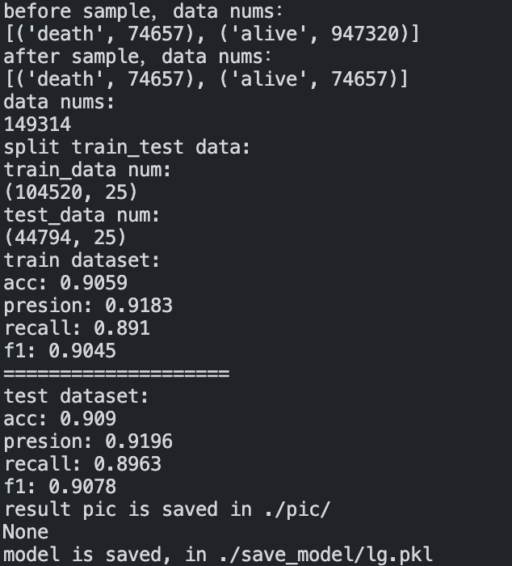
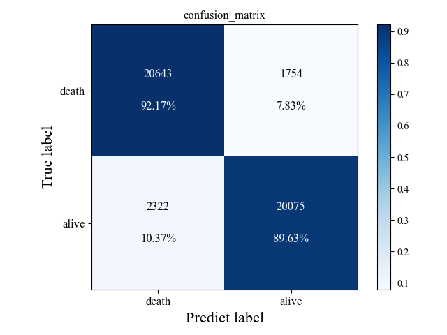
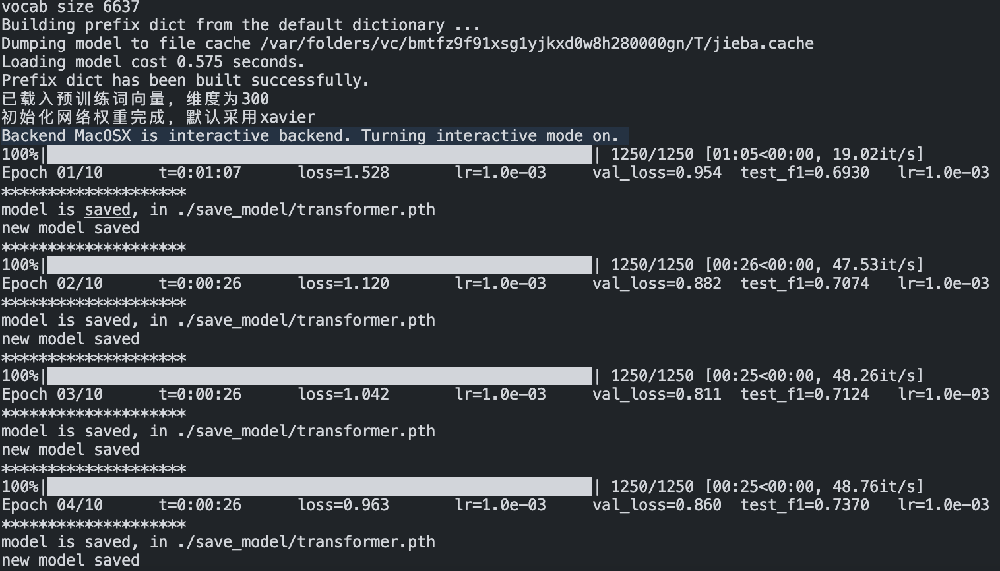
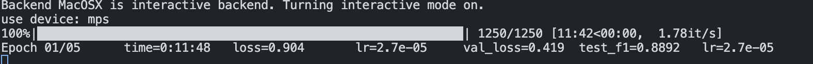

# 机器学习代码模板（开箱即用）


- [机器学习代码模板（开箱即用）](#机器学习代码模板开箱即用)
  - [关于 ](#关于-)
    - [1. 介绍](#1-介绍)
    - [2. 目前已经涵盖的算法](#2-目前已经涵盖的算法)
      - [2.1 常见的机器学习算法](#21-常见的机器学习算法)
      - [2.2 常见的深度学习算法](#22-常见的深度学习算法)
      - [2.3 预训练模型](#23-预训练模型)
  - [前提准备 ](#前提准备-)
    - [环境安装](#环境安装)
  - [具体使用方法 ](#具体使用方法-)
    - [数据集github传不上来，请移步 数据集下载，下载后直接解压到根目录即可](#数据集github传不上来请移步-数据集下载下载后直接解压到根目录即可)
    - [3. 参数介绍](#3-参数介绍)
    - [3.1 针对常见的机器学习算法](#31-针对常见的机器学习算法)
    - [3.2 针对深度神经网络算法](#32-针对深度神经网络算法)
    - [3.3 针对预训练模型](#33-针对预训练模型)
    - [Note：](#note)
  - [文件目录介绍](#文件目录介绍)
  - [开发日志](#开发日志)


---

## 关于 <a name = "关于"></a>
### 1. 介绍

> 这是一个包含多种机器学习算法的代码模板库，其主要用于NLP中文本分类的下游任务，包括二分类及多分类。使用者只需更改一些参数例如数据集地址，算法名称等，即可以使用其中的各种模型来进行文本分类（前提是数据集与我提供的数据集形式一致，具体可以看data/ 下我提供的数据集），各种算法的参数只在xx_config.py单个文件中提供，方便用户对神经网络模型进行调参。
### 2. 目前已经涵盖的算法
#### 2.1 常见的机器学习算法

- Logistic Regression
- KNN
- Decision Tree
- Random Forest
- GBDT(Gradient Boosting Decision Tree)
- XGBoost
- Catboost
- SVM
- Bayes
- todo...


#### 2.2 常见的深度学习算法

- TextCNN
- Bi-LSTM
- Transformer
- Capsules
- todo...

#### 2.3 预训练模型
- Bert
- MacBert
- NEZHA_WWM
- RoBerta
- todo...
---


## 前提准备 <a name = "前提准备"></a>

### 环境安装

具体的相关库的版本见requestments.txt

- 使用命令安装

```
pip install -r requestments.txt
```


## 具体使用方法 <a name = "具体使用方法"></a>
<br>

### 数据集github传不上来，请移步 [数据集下载](https://pan.baidu.com/s/1_2qhpb4eRbraFAShSoPVhQ?pwd=c4n6)，下载后直接解压到根目录即可
<br>

### 3. 参数介绍
***主程序：main.py，其中各个参数的含义如下：***

> *--data_path*: 一个完整的（未切分训练集测试集）的数据集路径
> 
> *--model_name*: 需要使用的算法名称，填写的简称见config.py中的ML_MODEL_NAME和DL_MODEL_NAME
> 
> *--model_saved_path*: 模型存储的路径
> 
> *--type_obj*: 程序的运行目的：train，test，predict三个选项
> 
> *--train_data_path*: 切分好的训练集路径
>
> *--test_data_path*: 切分好的测试集路径
> 
> *--dev_data_path*: 切分好的验证集路径
### 3.1 针对常见的机器学习算法

***终端命令如下：***
```
python main.py --data_path [] --model_name [] --model_saved_path [] --type_obj []
```
***示例***

```
# 训练
python main.py --data_path ./data/processed_data.csv --model_saved_path ./save_model/ --model_name lg --type_obj train
# 测试
python main.py --test_data_path ./data/processed_data.csv --model_saved_path ./save_model/ --model_name lg --type_obj test
# 预测
python main.py --dev_data_path ./data/processed_data.csv --model_saved_path ./save_model/ --model_name lg --type_obj predict
```

解释：这里的train_data_path, test_data_path, dev_data_path都默认为空，ml的数据处理模块会自动按照7：3划分训练集和测试集，并且默认进行下采样，避免数据不平衡带来的不良影响，划分比例和是否下采样参数可在config.py自行修改，如果参数train_data_path, test_data_path被指定，则无需指定data_path, split_size, is_sample参数

***运行结果如下：***



***结果图片展示：***



### 3.2 针对深度神经网络算法


***示例***

```
# 训练代码
# python main.py --model_name lstm --model_saved_path ./save_model/ --type_obj train --train_data_path ./data/dl_data/test.csv --test_data_path ./data/dl_data/dev.csv
# 测试代码
# python main.py --model_name lstm --model_saved_path ./save_model/ --type_obj test --test_data_path ./data/dl_data/test.csv
# 预测代码
# python main.py --model_name lstm --model_saved_path ./save_model/ --type_obj predict --dev_data_path ./data/dl_data/dev.csv
```
***运行结果如下：***


***结果图片展示：***

由于采用的数据是多分类，画的图比较乱，多分类暂时不输出图


### 3.3 针对预训练模型
***示例***
```
# 训练
# python main.py --model_name mac_bert --model_saved_path ./save_model/mac_bert --type_obj train --train_data_path ./data/dl_data/train.csv --test_data_path ./data/dl_data/test.csv --pretrain_file_path ./pretrain_model/mac_bert/
# 测试
# python main.py --model_name mac_bert --model_saved_path ./save_model/mac_bert --type_obj test --test_data_path ./data/dl_data/test.csv
# 预测
# python main.py --model_name mac_bert --model_saved_path ./save_model/mac_bert --type_obj predict --test_data_path ./data/dl_data/dev.csv
```
***运行结果如下：***


### Note：
>> **常见的机器学习算法调参在 ml_algorithm/ml_moel.py下<br>深度神经网络/预训练模型的调参在 dl_algorithm/dl_config.py下<br>其他全局参数调参在 ./config.py下<br>从transformers官网下载的预训练模型放在pretrain_model/下**

## 文件目录介绍

## 开发日志
|已添加的机器学习相关算法|已添加深度学习相关算法添加|其他功能新增或优化|
|:-|:-|:-|
|1. LogisticRegression<br> 2.KNN<br>3. DecisionTree<br>4. SVM|1. TextCNN<br>2. Bi-Lstm<br>3. Transfomer<br>4. Capsules # 按照17的论文直接改过来的，论文是图片分类，直接改成文本分类效果特别差，18年出了一篇基于胶囊网络的文本分类的论文，还没有看如何实现（**todo**）|1. 优化读取文件（增加用户指定训练集和测试集位置）<br> 2. 区分DL和ML模型的构建<br>3. DL模型的参数文件撰写<br>4. 处理DL的数据集兼容整体的DATAloader通用方法|
|5.GaussianNB<br>6. RandomForest<br>7. GBDT<br>8. XGBOOST|5. Bert<br>6. Mac_bert<br>7. NEZHA_WWM<br>8. RoBerta_WWM|5. plt.show阻塞问题，换成显示1S，然后保存在当前目录下<br>6. 深度学习中数据的处理（转换id，构建词表）<br>7. dataset类构建<br>8. 添加3种模型权重初始化代码|
|9. CatBOOST||9. 模型训练代码<br>10. 模型评估代码<br>11. 添加早停机制<br>12. 参数优化|
|||13. 解决Lstm的输出bug<br>14. 完成test,predict模块<br>15. main函数优化<br>16. 新增预训练词向量的载入功能|
|||17. 深度学习下，输入单个数据集，自动进行数据切分及下采样，无需人工划分和采样（**todo**）<br>18. 英文文本分类待添加，主要体现在分词部分（**todo**）<br>19. 添加竞赛trick【FGM、PGD、EMA】策略<br>20. 添加竞赛trick【将bert的cls输出修改为中间多层embed的输出加权平均，详情看bert_graph.py|
|||21. 所有代码的关键地方添加注释，方便理解修改代码<br>完善readme文档<br>添加mac电脑m系列芯片加速支持|
